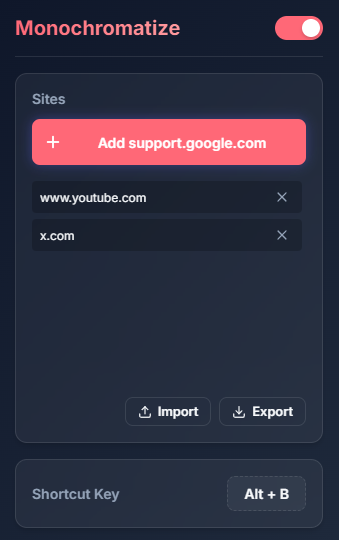

<div align="center">
  <h1>Monochromatize</h1>
  <p>A Chrome extension to turn specified websites into black and white (monochrome / grayscale).</p>

  [](https://github.com/npostring/monochromatize)
  [](LICENSE)
  [](https://developer.chrome.com/docs/extensions/mv3/intro/)

  
</div>

## ✨ Features

- **🎨 Modern & Premium UI**: A beautifully styled dark-themed popup UI featuring glassmorphism elements and smooth transitions.
- **👆 One-Click Toggle**: Instantly add or remove the current site from your list with a dedicated button that detects the active tab's domain.
- **📍 Per-Domain Targeting**: Manage a persistent list of domains where the grayscale effect should be applied.
- **📥 Import/Export**: Backup your site list to a JSON file or restore it easily, complete with domain sanitization.
- **⌨️ Customizable Shortcuts**: Modify your master toggle shortcut key straight from the popup interface (Default: `Alt + B`).
- **🌐 Global Disable**: Pause all active filters via a global master switch in the header.

## 🛠️ Installation / Build from Source

1. **Clone the repository** (or download the source).
2. **Install dependencies**:
   ```bash
   npm install
   ```
3. **Build the extension**:
   ```bash
   npm run build
   ```
4. **Load into Chrome**:
   - Open `chrome://extensions/` in your browser.
   - Enable **Developer mode** (top right toggle).
   - Click **Load unpacked** and select the `dist/` directory generated by the build.

## ⚙️ How it Works

Monochromatize uses a lightweight content script to inject a CSS `grayscale(100%)` filter onto the root element of matched domains. Settings are synced across your Google account using `chrome.storage.sync`.


